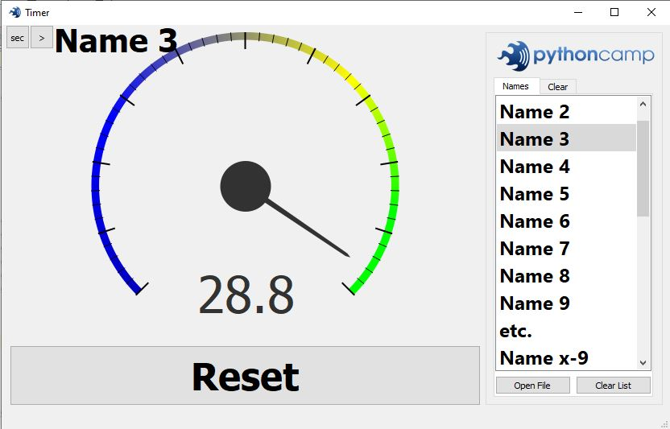
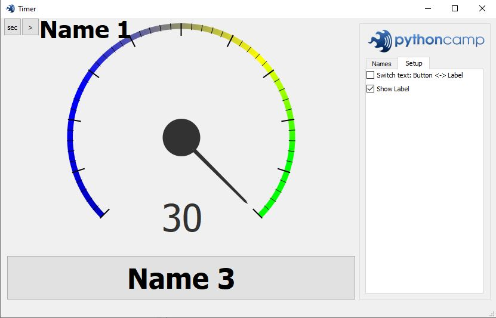
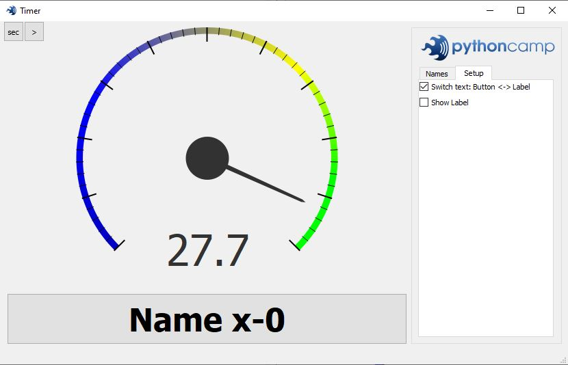
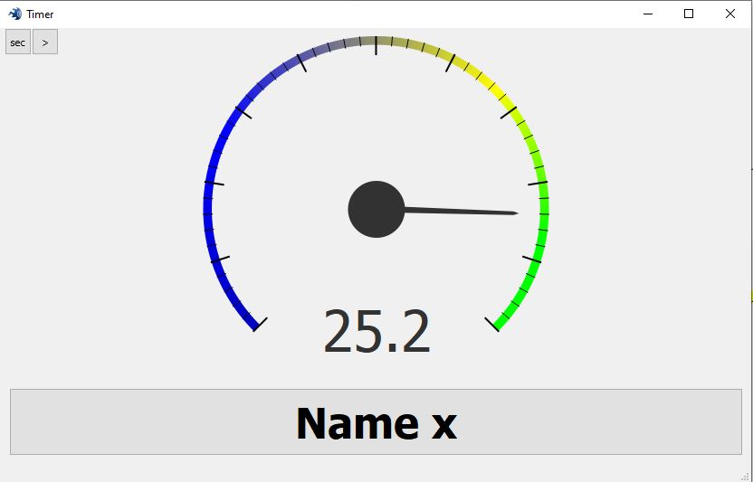

# Analog_PyQt_Timer

Just run: Start.py

Button functions:
- **sec** : input neu time / seconds
- **\>**: show / hide side bar
- **Open File**: Load new name list. Only *.txt files.
- **Clear List**: Clear Name list

CheckBox functions:
- **Switch text: Button <-> Label**: Toggle Display of "Status" / "Selected Name" between "Button" / "Name-Label"
- **Show Label**: Show/Hide Name-Label

## Show selected Name at Label and button function at pushButton text

## Show selected name instead of button function

## Hidden side bar

